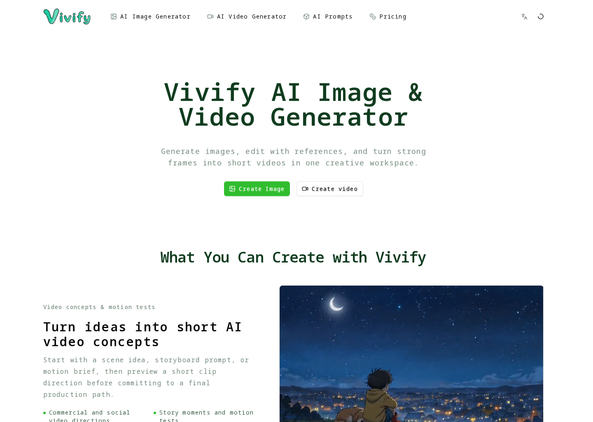
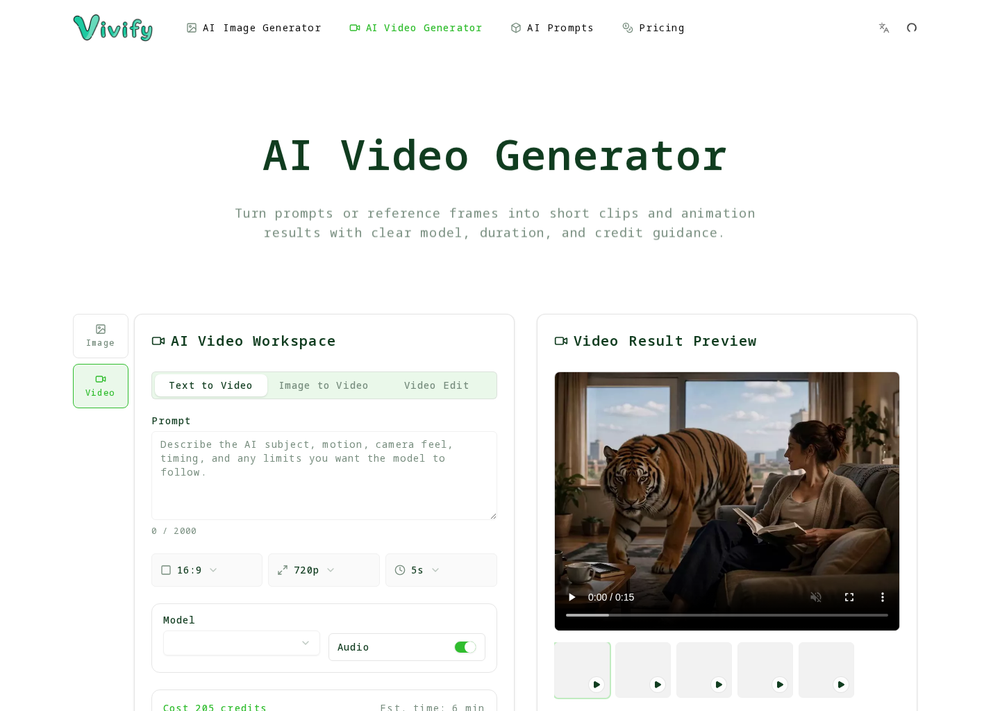
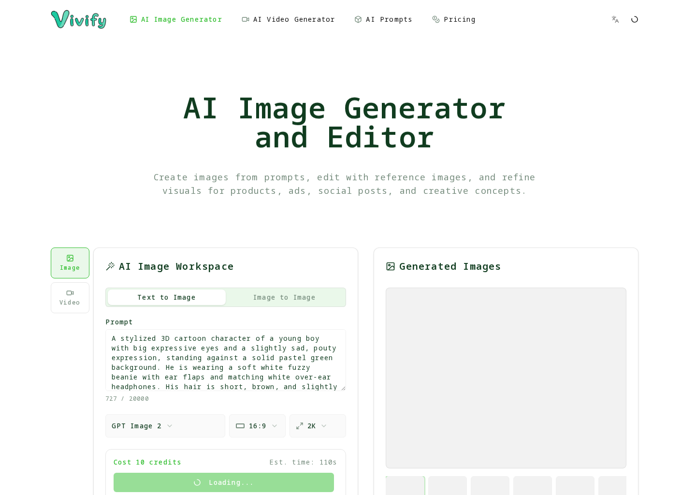

  

# Vivify

[Vivify](https://vivify.video) is an AI creative workspace for image generation and editing, text-to-video, image-to-video, and realtime face swap.

This is Vivify's official public repository for product feedback, issue reports, roadmap notes, support guidance, and community discussion. It does not contain the private production source code for the live product.

## Product Preview

[Watch the Vivify demo video](https://youtu.be/T1zlylN_sMw)

| AI video generator | AI image generator |
| --- | --- |
|  |  |

## Product Focus

- Generate images from prompts and references.
- Edit and refine images for creative production.
- Create videos from text prompts or source images.
- Transform a live camera feed with realtime face swap.

## Main Workflows

- Move from image generation and editing into video creation without changing tools.
- Create text-to-video and image-to-video generations with workflow-specific controls.
- Use realtime face swap for live creative camera experiences.
- Compare supported model capabilities, reference limits, duration, quality, and credit cost before generating.

## What To Open Here

- Reproducible problems in image generation, image editing, video generation, or realtime face swap
- Workflow clarity issues involving uploads, references, model selection, credit display, or history
- Product ideas, prompt-workflow feedback, and documentation improvements
- Pricing, billing, credit-pack, account, or login problems from the public product

## Repository Boundary

- Public issues and discussions are welcome when they improve the live product experience.
- Do not post private account data, secrets, payment details, uploaded personal media, or sensitive logs.
- Production application code, provider credentials, billing configuration, and deployment secrets are not published here.
- Security reports should follow [SECURITY.md](SECURITY.md) instead of public issues.

## Product Feature Links

- [AI image generator](https://vivify.video/ai-image-generator)
- [AI image editor](https://vivify.video/ai-image-editor)
- [AI video generator](https://vivify.video/ai-video-generator)
- [Realtime face swap](https://vivify.video/realtime-face-swap)

## Repository Links

| Destination | Link |
| --- | --- |
| Demo video | [Vivify AI video demo](https://youtu.be/T1zlylN_sMw) |
| Roadmap | [ROADMAP.md](ROADMAP.md) |
| Support | [SUPPORT.md](SUPPORT.md) |
| Security | [SECURITY.md](SECURITY.md) |
